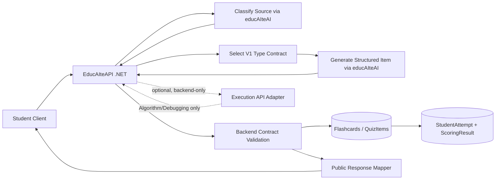

# Synthesized V1 Implementation Plan

## 1. Current System Summary
- **Generation flow today:**
  - **Flashcards (main path):** `generate-preview` then explicit `generated` save (`DeckFlashcardController` + `FlashcardGenerationService`).
  - **Flashcards (legacy/direct):** generate-and-persist still exists (`FlashcardController` note AI generate path and Node `generateFromNote` persistence flow).
  - **QuizItems:** preview/save endpoints exist, plus direct `generate` endpoint that chains preview then save.
- **Where AI is used:**
  - `.NET -> educAIteAI /api/agent/tasks` for flashcard preview/generation and flashcard answer analysis.
  - `educAIteAI /api/smart-quiz/*` uses ADK runners (classification, item generation, scoring, code feedback), but this is not the active `.NET` quiz generation path.
- **Where deterministic/fallback is used:**
  - `QuizItemGenerationService` uses `DefaultQuizItemGenerationClient` (deterministic template generator).
  - `DefaultQuizScoringClient` returns null, so quiz scoring falls back to deterministic `ScoringService` overlap rules.
  - Smart-quiz code execution supervisor is wired as `DisabledCodeExecutionSupervisor`.
- **Current multi-type support:**
  - Enum/contracts already include `Flashcard, Conceptual, CodeReading, Debugging, Sql, Algorithm, OutputPrediction, FillInCode, MultipleChoice, ShortAnswer` (and Node smart-quiz also has `Flowchart`).
- **Rubric/validation fields already present:**
  - Both `Flashcard` and `QuizItem` persist `RubricJson` and `ValidationConfigJson` as `jsonb`; both are currently returned in API responses.

## 2. V1 Gap Analysis

| Area | Current Implementation | V1 PRD Target | Gap | Recommended Action |
|---|---|---|---|---|
| V1 type guardrails | Allows Sql/FillInCode (and Flowchart in Node smart-quiz DTO) | Only 8 V1 types | No strict allowlist | Add shared V1 allowlist in .NET + Node; reject non-V1 at ingress |
| source material input | Source text exists; flashcard note-based input exists | Notes/lesson/paste with non-empty validation | Partial standardization | Keep existing inputs; normalize to one `sourceMaterial` contract in generation services |
| AI classification | Node has classifier endpoint with `recommendedItemTypes[]`; .NET generation does not use it | AI selects best supported single type first | Not wired; shape mismatch | Add classification step in `.NET -> educAIteAI` path with single `selectedItemType` |
| type-specific contracts | Generic draft schema | Strict per-type contracts | Missing typed contracts | Add per-type schemas (Zod + .NET DTO validation) behind current flow |
| Flashcard | Supported and persisted | V1 structured flashcard | Mostly aligned | Keep; tighten required fields and self-grading labels |
| Conceptual | Supported | V1 conceptual rubric-based | Mostly aligned | Keep; enforce rubric structure |
| CodeReading | Supported but generic | Contracted fields | Missing strict contract | Add required fields + exact/semantic validation mode |
| Debugging | Supported but generic; no persisted tests contract | Broken code + fix + tests | Missing strict private/public split | Add debugging validationConfig contract with private tests/fix |
| Algorithm | Supported but generic | Problem + signature + starter + tests + reference solution | Missing strict contract | Add algorithm validationConfig contract with private tests/reference |
| OutputPrediction | Supported but generic | Exact output contract | Missing strict exact-output config | Add exact-output validation settings |
| MultipleChoice | Supported but generic text | 4 options + correctOptionIds | Missing typed options contract | Add options schema + exact-option validator |
| ShortAnswer | Supported | brief expected + rubric/aliases | Partially covered | Enforce rubric + alias constraints |
| ValidationConfigJson | Free-form JSON string | Type-specific validation config | Opaque/no schema enforcement | Enforce per-type JSON schema before save |
| RubricJson | Free-form JSON string | Type-appropriate rubric | Opaque/no schema enforcement | Enforce minimal rubric shape per type |
| execution API | Endpoint exists; smart-quiz supervisor disabled | Judge code when needed | Not production-enabled | Keep interface; gate by config; start with disabled-safe behavior |
| hidden tests | Not first-class; possible in payload JSON; responses currently expose ValidationConfigJson | Never leak hidden tests/reference | Leak risk | Add public/private projection; never return private validation config |
| submission history | `StudentAttempt` + `ScoringResult` exist (quiz sessions) | Save attempts with result metadata | Mostly aligned | Reuse existing entities; add type-aware attempt context shape |
| preview + save flow | Implemented and stable | Preserve | Aligned | Keep as primary write path |
| legacy direct generation path | Still available in flashcards and quiz-item `generate` | Prefer controlled preview+save | Competing paths | Deprecate/feature-flag direct path; route clients to preview+save |

## 3. Synthesized V1 Scope

### Implement Now
- V1 type allowlist enforcement (exclude Sql/FillInCode everywhere).
- Classification contract (`selectedItemType`, reason, confidence, language, requiresExecutionValidation).
- Per-type generation contracts for the 8 V1 types.
- Backend validation for required fields + rubric/validation config schemas.
- Private/public payload separation to prevent hidden tests/reference leaks.
- Preserve and standardize preview + save as canonical generation flow.

### Keep As-Is
- Existing ownership checks, deck/session orchestration, persistence boundaries in EducAIteAPI.
- Existing `RubricJson`/`ValidationConfigJson` storage columns.
- Existing `StudentAttempt`/`ScoringResult` history mechanism.

### Modify Lightly
- `DefaultQuizItemGenerationClient` behavior: enforce V1 type guardrails and remove Sql/FillInCode generation.
- Node smart-quiz/flashcard DTOs: remove non-V1 exposure from generation paths.
- API response projection: stop returning private validation internals.

### Postpone
- Dedicated test-case tables/entities (continue storing test artifacts in `ValidationConfigJson` for V1).
- Full execution runtime rollout (keep interface-first with config gating).

### Explicitly Exclude
- Sql
- FillInCode
- V2 features
- Teacher/admin approval flow

## 4. Recommended V1 Architecture
- **EducAIteAPI (.NET):** source intake, ownership checks, classification+generation orchestration, contract validation, persistence, safe response projection.
- **educAIteAI (Node/ADK):** classification + type-specific structured generation; optional code-judge adapter interface.
- **QuizItems/Flashcards:** remain persistence targets; store public content + private validation metadata separately within existing JSON fields.
- **Execution API:** optional backend-only adapter for Algorithm/Debugging; disabled-safe fallback until configured.



## 5. Practical Type-Specific Behavior

### Flashcard
- Generation: AI generates recall card from source.
- Required fields: `front/question`, `back/expectedAnswer`, `explanation`, `difficulty`.
- Validation: required text + difficulty bounds.
- Grading: self-grade labels + existing semantic support.
- Storage: `Flashcard`/`QuizItem` with `RubricJson` + `ValidationConfigJson` (public-safe subset).

### Conceptual
- Generation: explanation/principle question.
- Required fields: `question`, `expectedAnswer`, `conceptExplanation`, `rubric`.
- Validation: rubric structure (`requiredIdeas`, threshold).
- Grading: semantic + rubric overlap.
- Storage: same, rubric emphasized.

### CodeReading
- Generation: explain provided snippet behavior.
- Required fields: `language`, `codeSnippet`, `question`, `expectedAnswer`, `explanation`.
- Validation: non-empty snippet/language; exact-or-semantic mode in validation config.
- Grading: semantic default, optional exact checks.
- Storage: snippet public; strict grader settings in validation config.

### OutputPrediction
- Generation: predict exact output from snippet.
- Required fields: `language`, `codeSnippet`, `question`, `expectedOutput`, `explanation`.
- Validation: exact-output mode required.
- Grading: exact output match (normalized whitespace rules).
- Storage: expected output public; normalization rules in validation config.

### MultipleChoice
- Generation: 4-option conceptual check.
- Required fields: `question`, `options[4]`, `correctOptionIds`, `explanation`.
- Validation: exactly 4 unique options; valid answer ids.
- Grading: exact option-id matching.
- Storage: options public; scoring policy in validation config.

### ShortAnswer
- Generation: concise written response.
- Required fields: `question`, `expectedAnswer`, `acceptedAnswerAliases`, `rubric`, `answeringGuidance`.
- Validation: alias/rubric structure.
- Grading: semantic + rubric threshold.
- Storage: aliases/rubric retained.

### Algorithm
- Generation: coding problem with starter and tests.
- Required fields: `title`, `problemStatement`, `supportedLanguages`, `functionSignature`, `starterCodeByLanguage`, `visibleTestCases`, **private** hidden tests/reference.
- Validation: schema + test payload integrity.
- Grading: semantic fallback now; execution-backed when enabled.
- Storage: public prompt fields + **private** hidden tests/reference in validation config.
- Execution API status: behind interface, disabled by default in current repo context.

### Debugging
- Generation: buggy code repair task.
- Required fields: `language`, `buggyCode`, `question`, `bugExplanation`, `visibleTestCases`, **private** expectedFix/hidden tests.
- Validation: schema + sanity checks.
- Grading: semantic fallback now; execution-backed when enabled.
- Storage: buggy code public; expected fix/hidden tests private.
- Execution API status: behind interface, disabled by default in current repo context.

## 6. Data Contract Recommendation

### Classification Result
```json
{
  "selectedItemType": "Algorithm",
  "reason": "Source focuses on array/hash-map problem solving",
  "confidence": 0.87,
  "technicalLanguage": "Python",
  "requiresExecutionValidation": true
}
```

### Flashcard
```json
{
  "itemType": "Flashcard",
  "question": "What is LIFO?",
  "expectedAnswer": "Last In, First Out",
  "explanation": "Stack order",
  "difficulty": 35
}
```

### Conceptual
```json
{
  "itemType": "Conceptual",
  "question": "Why use dependency injection?",
  "expectedAnswer": "Improves testability and decoupling",
  "rubric": { "requiredIdeas": ["testability", "decoupling"], "passingThreshold": 2 }
}
```

### CodeReading
```json
{
  "itemType": "CodeReading",
  "language": "Java",
  "codeSnippet": "int x=5; x++;",
  "question": "What is x after execution?",
  "expectedAnswer": "6"
}
```

### OutputPrediction
```json
{
  "itemType": "OutputPrediction",
  "language": "Python",
  "codeSnippet": "print([1,2,3][1])",
  "question": "What is the output?",
  "expectedOutput": "2"
}
```

### MultipleChoice
```json
{
  "itemType": "MultipleChoice",
  "question": "Which describes DI?",
  "options": [{"id":"A","text":"..."},{"id":"B","text":"..."},{"id":"C","text":"..."},{"id":"D","text":"..."}],
  "correctOptionIds": ["B"],
  "explanation": "Dependencies are provided externally"
}
```

### ShortAnswer
```json
{
  "itemType": "ShortAnswer",
  "question": "Stack vs queue?",
  "expectedAnswer": "Stack is LIFO, queue is FIFO",
  "acceptedAnswerAliases": ["LIFO for stack, FIFO for queue"],
  "rubric": { "requiredIdeas": ["LIFO", "FIFO"], "passingThreshold": 2 }
}
```

### Algorithm
```json
{
  "itemType": "Algorithm",
  "title": "Find max value",
  "problemStatement": "Return largest integer in array",
  "functionSignature": { "functionName": "findMax", "parameters": [{"name":"nums","type":"int[]"}], "returnType": "int" },
  "starterCodeByLanguage": { "python": "def find_max(nums):\n    pass" },
  "visibleTestCases": [{"name":"Example 1","args":[[1,5,3]],"expectedOutput":5}],
  "private": {
    "hiddenTestCases": [{"name":"Hidden 1","args":[[-10,-2,-30]],"expectedOutput":-2}],
    "referenceSolutionByLanguage": { "python": "def find_max(nums): return max(nums)" }
  }
}
```

### Debugging
```json
{
  "itemType": "Debugging",
  "language": "Java",
  "buggyCode": "map.put(n, map.getOrDefault(map.get(n), 0) + 1);",
  "question": "Find and fix the bug",
  "bugExplanation": "Wrong key used in getOrDefault",
  "visibleTestCases": [{"name":"Example 1","args":[[2,2,1]],"expectedOutput":1}],
  "private": {
    "expectedFix": "map.put(n, map.getOrDefault(n, 0) + 1);",
    "hiddenTestCases": [{"name":"Hidden 1","args":[[4,1,2,1,2]],"expectedOutput":4}]
  }
}
```

## 7. Backend Validation Rules
- Enforce allowed types: `{Flashcard, Conceptual, CodeReading, Debugging, Algorithm, OutputPrediction, MultipleChoice, ShortAnswer}` only.
- Per-type required field checks before preview response and before save.
- `RubricJson`: must match minimal schema for rubric-enabled types (Conceptual/ShortAnswer and optional others).
- `ValidationConfigJson`: must match per-type schema; reject unknown required-private/public shape violations.
- Hidden test protection: never map hidden tests into public DTOs; keep only counts/summaries in responses.
- Reference solution protection: store private only; never return via `FlashcardResponse`, `QuizItemResponse`, or session item responses.
- Unsupported type handling: reject with validation error (preferred) and optionally fallback to `Conceptual` only when explicitly configured for backward compatibility.

## 8. Execution Strategy for V1
**Recommended option:** **Execution API added behind an interface but disabled until configured.**

Reason: this matches current reality (`DisabledCodeExecutionSupervisor`) while allowing Algorithm/Debugging contracts now, safe persistence now, and execution enablement later without redesign.

## 9. Migration Plan

## Slice 1: V1 Guardrails
- [ ] Add shared V1 type allowlist in .NET and Node DTOs.
- [ ] Block Sql/FillInCode (and Flowchart in smart-quiz generation path).

## Slice 2: Classification Contract
- [ ] Add `.NET -> educAIteAI` classification call returning single `selectedItemType`.
- [ ] Validate selected type against V1 allowlist.

## Slice 3: Type-Specific Generation Contracts
- [ ] Add per-type generation schemas for 8 V1 types.
- [ ] Keep current preview response envelope, swap generic draft internals for typed contracts.

## Slice 4: Backend Validation
- [ ] Validate typed payloads before preview return.
- [ ] Re-validate before save to persistence.
- [ ] Add strict `RubricJson` and `ValidationConfigJson` schema checks.

## Slice 5: Storage Mapping
- [ ] Map public fields to existing `Question/Answer/Explanation/...`.
- [ ] Store private grading artifacts in `ValidationConfigJson` only.
- [ ] Add public/private response mapper to prevent leaks.

## Slice 6: Student Answer and Grading
- [ ] Reuse `StudentAttempt` + `ScoringResult`.
- [ ] Add type-aware grading strategy selection (semantic/exact-option/exact-output/rubric).

## Slice 7: Algorithm and Debugging Validation
- [ ] Enforce test/reference presence in private config.
- [ ] Keep execution adapter off by default; return safe fallback grading when unavailable.

## Slice 8: Acceptance Gate
- [ ] Verify only V1 types are generated and saved.
- [ ] Verify hidden tests/reference never appear in frontend DTOs.
- [ ] Verify preview+save remains primary path.

## 10. Risks and Mitigations

| Risk | Impact | Mitigation |
|---|---|---|
| AI chooses wrong type | Poor learning experience | Add confidence threshold + backend type override policy |
| AI returns invalid JSON | Generation failure | Strict schema parsing + retry with corrective prompt + fail fast |
| AI generates weak Algorithm tests | Low assessment quality | Add deterministic test-quality lint rules before save |
| Debugging expected fix is too narrow | False negatives | Support behavioral equivalence checks via tests, not string-only fix checks |
| hidden tests leak | Security/integrity issue | Public/private response mapper + contract tests for leak prevention |
| execution API unavailable | Code grading blocked | Interface-gated fallback mode + clear status in scoring source |
| current fallback generator conflicts with AI generation | Inconsistent outputs | Feature-flag path selection; make one canonical generation path per endpoint |
| schema drift between .NET and Node | Runtime failures | Shared contract version field + compatibility checks in CI |

## 11. Final Recommendation
- **Implement first:** V1 type guardrails, classification contract, per-type schema validation, and private/public response projection while preserving preview+save.
- **Postpone:** execution runtime rollout and dedicated test-case tables.
- **Do not change yet:** existing ownership/session/persistence architecture and existing `StudentAttempt`/`ScoringResult` model.
- **Avoid hallucination/scope creep:** lock to the 8 V1 types, require JSON-schema validation at each boundary, and block any non-V1 type or untyped payload from persistence.
